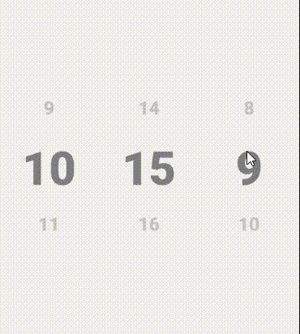
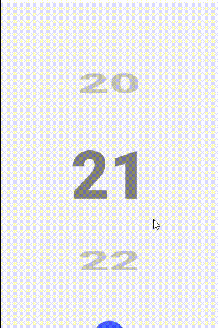
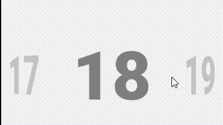

- A react native custom component of dynamic carousel (horizontal and vertical) with react native animated. can be used as a wheel spinner.

- It comes with a built-in TypeScript typings and is compatible with all popular JavaScript frameworks including React , Vue , Svelte , and Angular . You can use RN-Animated-Donut-Chart directly or leverage well-maintained wrapper packages that allow for a more native integration with your frameworks of choice.

# Semi circular donut chart:






# Full circular donut chart:


# How to use:

```
   const data1 = dayesInMonth.map((item, index) => ({
     ['text']: item,
   }));
  const data2 = [
    {
      index: 0,
      url: 'https://reactnative.dev/img/tiny_logo.png',
    },
    {
      index: 1,
      url: 'https://reactnative.dev/img/tiny_logo.png',
    },
    {
      index: 2,
      url: 'https://reactnative.dev/img/tiny_logo.png',
    },
    {
      index: 3,
      url: 'https://reactnative.dev/img/tiny_logo.png',
    },
    {
      index: 4,
      url: 'https://reactnative.dev/img/tiny_logo.png',
    },
    {
      index: 5,
      url: 'https://reactnative.dev/img/tiny_logo.png',
    },
  ];

<Spinner
        isHorizontal={false}
        data={data}
        height={height}
        itemStyle={{padding: 5}}
        itemHeightPrecentageFromHeight={0.5}
        itemwidthPrecentageFromWidth={0.5}
        itemVerticalRotationDegreeRange={['-60deg', '0deg', '60deg']}
        ItemView={(props: {url: string}) => (
          <Image
            source={{uri: props.url}}
            style={{width: '100%', height: '100%'}}
          />
        )}
      />
      <Spinner
        isHorizontal={false}
        data={data}
        height={height}
        itemStyle={{padding: 5}}
        itemHeightPrecentageFromHeight={0.5}
        itemwidthPrecentageFromWidth={0.5}
        itemVerticalRotationDegreeRange={['-60deg', '0deg', '60deg']}
        ItemView={(props: {url: string}) => (


         <Text
            style={{
            fontSize: height * 0.3,
            color: 'gray',
            fontWeight: '900',
            textAlign: 'center',
            }}>
            {props.text}
           </Text>
        )}
      />
```

> **Dataset Properties**

| Name                              | Type                        | Default |
| --------------------------------- | --------------------------- | ------- |
| data                              | any[]                       |
| height                            | number                      |
| isHorizontal                      | boolean                     |
| outputRangeOpacity                | number[]                    |
| outputRangeScale                  | number[]                    |
| itemVerticalRotationDegreeRange   | string[]                    |
| itemHorizontalRotationDegreeRange | string[]                    |
| flatListProps                     | {}                          |
| itemStyle                         | ViewStyle                   |
| itemHeightPrecentageFromHeight    | number                      |
| itemwidthPrecentageFromWidth      | number                      |
| ItemView                          | (props: any) => JSX.Element |
